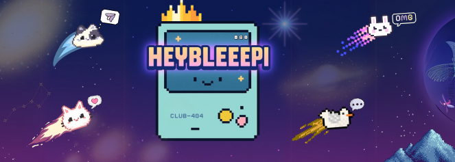

  

  
<strong>💬 𝗦𝗮𝘆 𝗵𝗲𝘆. 𝗗𝗿𝗼𝗽 𝗮 𝗯𝗹𝗲𝗲𝗽.</strong>

  

### 👋 Welcome to **HeyBleeepi**

**HeyBleeepi** is a social media-style platform that lets users interact through dynamic posts, real-time comments, and social engagement tools. With a modern and intuitive interface, it makes connecting online simple and fun.

- Create dynamic posts 📝
- React, comment, and share content 💬
- Stay connected with a global feed 🌍

> 💬 **Join the conversation today! Register and explore HeyBleeepi now.**

---

## 🚀 Features

- **Post Management** – Create, edit, and delete your own posts
- **Interactive Feed** – Global timeline view for all users
- **Social Actions** – Like ❤️, Comment 💬, and Share 🔁 on posts
- **Mobile-Responsive** – Optimized for all devices
- **User Authentication** – Secure login and registration system

---

## 🌐 Web Hosting

- **Hosted on:** Hostinger
- **Live URL:** [heybleepi.site](https://heybleepi.site/PROJECT-CLUB-404/heybleepi/codes/php/index.php)

---

## 👤 Sample Account

To explore without registering:

- **Email:** `joe123@example.com`
- **Password:** `joe123`

---

## 🧰 Tech Stack

### Backend

### Frontend

### Database

---

## 👥 Meet the Team

| Name | Role |
|------|------|
| 👨‍💻 John Matthew Arroyo | Tech Lead / Developer |
| 👨‍💻 Justine Delima | Tester / Developer |
| 👩‍💻 Patricia Joy Relente | Project Manager / Developer |
| 👩‍💻 Ma. Bea Mae Ynion | UI/UX Designer / Developer |

---
