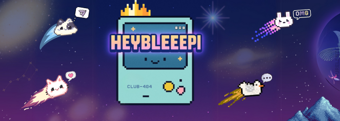

   

# HEYBLEEPI

### Welcome to _HeyBleeepi!_ 👋

**HeyBleeepi** is your go-to platform for connecting with others online through 
dynamic posts. With a simple and intuitive interface, HeyBleeepi makes it easy
and enjoyable to share thoughts, engage with others, and build connections.

Join the conversation today! Register and explore HeyBleeepi now.

<h3> Features of <em>HeyBleeepi</em> ⚙️</h3>

- [x] Create and Manage Your Own Post _(Edit & Delete)_
- [x] Has a global timeline/wall.
- [x] React, Comment, & Share of posts.

### Web Host ⚙️
- [x] Hostinger

### TechStack ⌨️
### Backend:
> PHP & JS

### Frontend:
>  HTML, CSS and JS

### Database: 
> MySQL

### The Team:

👨‍💻 John Matthew Arroyo - Tech Lead/Developer

   👨‍💻 Justine Delima - Tester/Developer

   👩‍💻 Patricia Joy Relente - Project Manager/Developer

   👩‍💻 Ma. Bea Mae Ynion - UI/UX Designer/Developer

